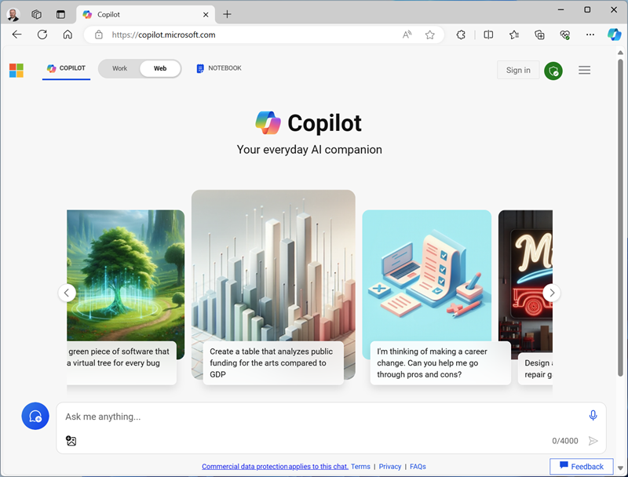

---
lab:
    title: 'Exercise Title'
---
<!--
Edit the metadata above to manage the list of exercises in the home page of the GitHub site that gets generated.
You can delete the module and edit index.md in the root of the repo to customize the display so that only the exercises are listed
To enable GitHub page publishing, edit the Page settings for the repo and publish from the main branch
-->

# Exercise title <!-- match title in metadata above (and Learn Exercise unit and ILT slide)-->

In this exercise you will <!-- provide a description of what they'll do and why it;s important -->

This exercise should take approximately **XX** minutes to complete. <!-- update with estimated duration -->

## Before you start

<!--
Add steps to get the learner to the starting point" for the exercise. This might be cloning the repo and running a script or performing some manual steps.

Only include this section if its necessary to do some pre-exercise setup AND the same setup steps are required for self-paced (on Learn) and managed (in hosted ILT lab profiles) scenarios. Otherwise delete this section.
If self-paced /ILT-specific setup steps are required, include them in the Learn "Exercise" unit from where they open this exercise and in the Skillable lab profile instructions before this markdown file is imported.

Do not include requirements for getting an Azure (or other) subscription (write the exercise on the assumption the learner has a functioning lab environment - this section is only for exercise-specific steps to get to a starting point)

If there are complex setup steps that apply to ALL of the exercises in the repo (for example, installing and configuring client-side tools), create a separate 00-setup.md file with instructions.
 -->

Before you can start this exercise, you will need to...

1. Step 1
1. Step 2
1. etc.

## Task <!-- Change to an appropriate task title with an imperative verb phrase (e.g. "Do something") -->

First, you need to ...

1. Step 1
1. This step includes an example of `inline code formatting`, which is used when the learner needs to type something (anything, not just code) because it creates a [T] link in the hosted Skillable environment.
1. If you need the learner to open a website, include both a link (so they can open by clicking in the HTML GitHub page) AND the URL formatted as code (so they can type it in a hosted VM browser). For example, "Open the [Bing](https://www.bing.com) website at `https://www.bing.com`".
1. If you need the learner to download a file (or a bunch of files in a zip), store the file in Allfiles folder in this repo and use the **raw** URL - like this: "Download [file name](https://raw.githubusercontent.com/MicrosoftLearning/INF99X-SampleCourse/master/Allfiles/Labs/01/Starter/azuredeploy.json) from `https://raw.githubusercontent.com/MicrosoftLearning/INF99X-SampleCourse/master/Allfiles/Labs/01/Starter/azuredeploy.json`.
1. Alternatively, for a developer audience, you can have them clone this repo if that seems more appropriate.
1. If you need to include a multiline code block, indent it to match the bulleted list indent:

    ```python
    # This is an example of an
    # indented code block.
    ```

1. If you need to include a acreenshot, resize it to an appropriate size (so any "normal" formatted text in a partial screenshot is roughly the same size as this text - generally try to make screenshots of full application windows 800x600px (approx)). Store images in a **Media** subfolder and use markdown to add it to the page (remembering that file and folder names are case-sensitive). If the image is in a list, indent it, like this:

     

1. If you need to explain why something is done the way it is, or provide additional context or links to info, use a note like this:

    > **Note**: This is a note.

1. Be flexible when providing instructions that might vary between self-paced and hosted lab environments. For example:
    - "Sign in using your Azure credentials" (assuming there were Learn-specific instructions to use a personal subscription or create a trial in the Learn exercise page, and ILT-specific instructions to use provided cloudslice credentials in the Skillable lab profile)
    - "Select an existing resource group or create a new one" (assuming that if a Skillable CS-R cloudslice is used, you included a note in the lab profile telling the learner which resource group they should use)
    <!-- The key point is that this markdown file should be environment-agnostic - you need to provide explicit details of things that can vary OUTSIDE of this file (in the Learn exercise page or the Skillable lab profile instructions) -->
1. etc.

## Next task

Now let's, ...

1. Step 1
1. Step 2
1. etc.

## Task with subtasks

Sometimes you might want to break a task down into smaller chunks.

### Subtask 1

1. Step 1
1. Step 2
1. Etc.

### Subtask 2

1. Step 1
1. Step 2
1. etc.

## Clean up

<!-- Good practice - especially as self-paced learners will be using their own subscriptions -->
<!-- Delete this section if it is not needed -->

Now that you've finished the exercise, you should delete the cloud resources you've created to avoid unnecessary resource usage.

1. Step 1
2. etc.
